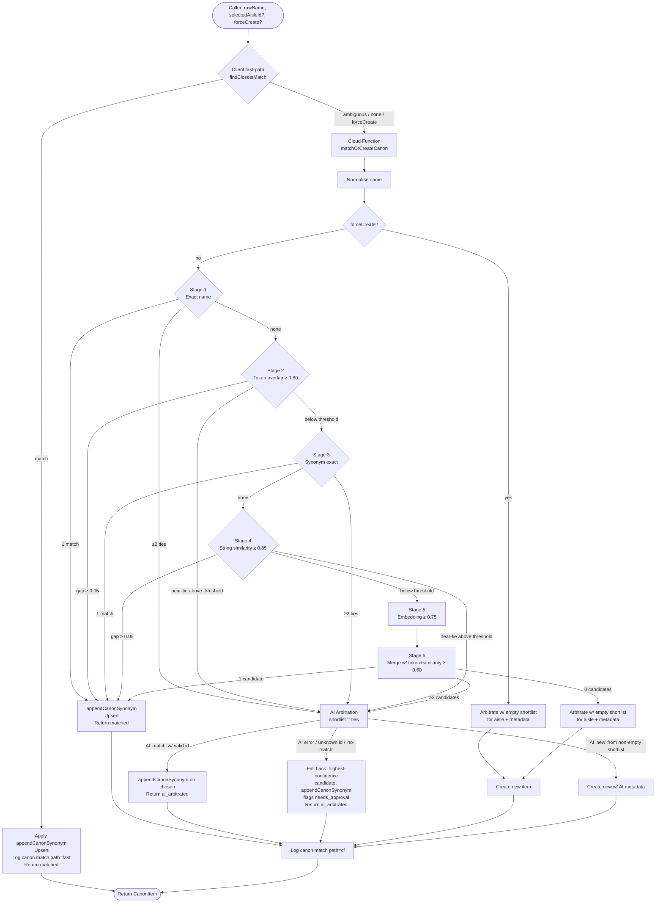

# Canon Item Matching Pipeline

Salt resolves a free-text item name to one canonical `CanonItem` through a multi-stage pipeline. Cheap deterministic checks run first; AI arbitration and embeddings run only when the deterministic stages can't decide. The pipeline is authoritative — it always returns one concrete `CanonItem` and is the only path that writes synonyms or sets `needs_approval`.

The same pipeline is the entry point for all four use cases: manual canon item add, shopping list add, recipe add, and recipe ingredient update. None of them block on a user dialog mid-flow.

---

## Authority and runtime

The pipeline is invoked from two server-side entry points:

1. **`matchOrCreateCanon` CF callable** — the client-facing entry point for explicit canon resolution (manual canon item add, recipe add, recipe ingredient update). Composes Firestore-admin stores, Genkit-backed embedding + arbitration adapters, an ID generator, and a fan-out `MatchLoggingPort` that writes each resolution to two destinations: LaunchDarkly (via the LD Node SDK, parity with the fast-path's wire shape — see [Logging schema](#logging-schema)) and `firebase-functions/logger` (top-level summary only, additive for Cloud Logging).

2. **`onShoppingListItemWrite` Firestore trigger** — fires on every write to `shoppingLists/{listId}/items/{itemId}`. Idempotency: skips when `matchState !== 'pending'` or `canonId` is already set (CF own write). Before matching, runs `parseShoppingListEntry` (deterministic) to split the raw entry into a clean item name, an optional trailing context note, and optional structured `amount` (number) and `unit` (string); for compound entries (≥3 words) where neither context nor a structured amount was extracted, falls back to the `EntryParsePort` AI adapter and degrades gracefully on failure. The clean name and the original `rawText` are fed to `matchOrCreate` via `buildMatchOrCreatePorts`; `rawText` is forwarded as optional context to the arbitration AI prompt when it differs from the normalised name. On success, if the name changed and the item's `notes` field is currently empty, writes `rawText: cleanName` and `notes: context` atomically with `canonId` and `matchState`. Writes `canonId`, `matchState` (`matched` | `needs_approval` | `failed`), and — when parsed — `amount` and `unit` back to the item document on both success and failure paths. This is the matching entry point for shopping list adds.

The client also runs a **fast-path** for stages 1–4 against the in-memory canon snapshot. If `findClosestMatch` returns a clear `'match'`, the client applies `appendCanonSynonym`, persists, and returns without a CF round-trip. `'ambiguous'` and `'none'` always escalate to the CF callable; `forceCreate` always escalates so the CF can run aisle arbitration. Stages 1–4 are executed by the same `findClosestMatch` function in both places, so the deterministic outcome is identical for the same canon snapshot. Both paths attach a `canon.path: 'fast' | 'cf'` attribute to their span so dashboards can split traffic.

`findClosestMatch` is the only stage 1–4 entry point — `tokenMatch`, `stringSimilarity`, `synonymMatch`, and `embedMatch` are not exported and the boundary lint forbids reaching past `findClosestMatch` to call them.

---

## Flow diagram

---

## Stage-by-stage narrative

> **Stages 1–4 are dual-run.** They live in [`findClosestMatch`](../packages/domain/src/canon/queries/findClosestMatch.ts) and execute on both the client fast-path (against the in-memory canon snapshot) and the CF (against the Firestore-loaded canon). Same code, same stage logs, same `'match' | 'ambiguous' | 'none'` outcome for the same input + canon. Stages 5–6 and AI arbitration are CF-only.

### Stage 1 — Exact name match

Both query and every canon item name run through `normaliseName` (lowercase, trim, collapse whitespace). One winner → `match`. Two or more winners → `ambiguous` (sent to AI arbitration to disambiguate true duplicates). No winners → fall through to stage 2.

### Stage 2 — Token overlap

Jaccard-style overlap between word tokens of the query and item name. Threshold **0.80**. If best ≥ threshold and (best − second) ≥ ambiguity gap (**0.05**), `match`. If best ≥ threshold but the gap is too small, all near-ties become an `ambiguous` shortlist.

### Stage 3 — Synonym exact match

Each `CanonItem` carries normalised synonyms accumulated from past confirmed matches. Stage 3 checks for an exact synonym hit. Single hit → `match`. Multiple hits → `ambiguous`. No hits → fall through to stage 4.

### Stage 4 — String similarity (Levenshtein)

Normalised Levenshtein distance. Threshold **0.85**. Same ambiguity-gap rule as stage 2.

### Stage 5 — Embedding cosine

Gemini embedding of the query, cosine similarity against every canon item with a stored embedding. Threshold **0.75**. Embedding *never* auto-matches on its own — it only feeds the shortlist. Tie-break favours already-approved items so the review queue isn't padded.

### Stage 6 — Merged shortlist + AI arbitration

Stage 6 re-runs token overlap and string similarity at the lower **0.60** `aiThreshold` and merges them with stage-5 candidates into a single deduplicated shortlist ordered by confidence.

- 0 candidates → arbitrate with an empty shortlist (purely for aisle/metadata) and create.
- 1 candidate → `match` directly without calling arbitration.
- ≥2 candidates → AI arbitration on the shortlist.

---

## AI Arbitration

AI arbitration is the sole decider after stages 1–4 produce an `'ambiguous'` shortlist or stage 6 produces a multi-candidate shortlist. There is **no `'candidates'` decision and no mid-flow user dialog** — review happens later, asynchronously, via the `needs_approval` flag.

When `rawText` (the original user entry) differs from the normalised item name, it is passed to the arbitration prompt as a context hint — container or descriptor words such as "tin of", "smoked", or "fresh" can help the model distinguish near-duplicate canon items. The model always matches against the normalised name; `rawText` is informational only.

### AI-fallback rule (behavioural contract)

The pipeline falls back to the **highest-confidence shortlist candidate**, flagged `needs_approval` (set by `appendCanonSynonym`), on any of these three triggers:

1. **AI adapter error.**
2. **AI returns `kind: 'match'` with an `itemId` not present in the shortlist** (unknown id).
3. **AI returns `kind: 'no-match'` from a non-empty shortlist.**

`AI 'new'` is the **only** path that creates a brand-new item from a non-empty shortlist.

The empty-shortlist case is different: with no candidates to fall back to, AI error or `'no-match'` results in a fresh create (with whatever aisle/metadata arbitration managed to return, or none). All four entry points (canon add, shopping list add, recipe add, recipe ingredient update) inherit this same rule via the shared CF.

| AI response (non-empty shortlist) | Pipeline action | Decision returned |
|---|---|---|
| `match` with valid `itemId` | `appendCanonSynonym` on chosen item; AI `reasoning` stored on item if present | `ai_arbitrated` |
| `match` with unknown `itemId` | Fall back to top-confidence candidate, flag `needs_approval` | `ai_arbitrated` |
| `new` (with metadata) | Create new item with AI-suggested aisle, behaviour, unit; `reasoning` stored if present | `created` |
| `no-match` | Fall back to top-confidence candidate, flag `needs_approval` | `ai_arbitrated` |
| Error | Fall back to top-confidence candidate, flag `needs_approval` | `ai_arbitrated` |

### Why fall back rather than create new

A non-empty shortlist means at least one item scored above `aiThreshold` (0.60) on token overlap, similarity, or embedding cosine. Treating an AI failure mode as licence to create a duplicate would silently pad the canon with near-twins. Surfacing the resolution as `needs_approval` instead lets the human review queue catch it, while still returning a usable `CanonItem` to the caller — shopping list adds (the most latency-sensitive entry point) stay non-blocking.

---

## Review via `needs_approval`

`needs_approval` is the universal "human should look at this" signal. `appendCanonSynonym` sets it whenever a synonym is added; the AI-fallback path inherits it that way. When AI arbitration returns a `'match'` or `'new'` response that includes a `reasoning` string, `appendCanonSynonym` (or the item-creation path) also stores that string as `CanonItem.reasoning` — it surfaces in the canon review UI alongside `needs_approval` items for auditing why the AI made a given decision. When arbitration is invoked during new-item creation (empty-shortlist or `forceCreate` paths) but fails to produce a canonical name, a sentinel string is written instead: `ARBITRATION_FAILED_REASONING` when the adapter returned an error, or `ARBITRATION_NO_MATCH_REASONING` when the AI ran but returned no match. This lets the review queue distinguish the two failure modes while still creating the item with raw input and flagging `needs_approval`. The canon list page is the review queue: items with `needs_approval` are highlighted, promoted to the top, and support multi-select bulk-approve. The canon nav menu item carries a count badge of `needs_approval === true` items so the queue is visible from anywhere in the app.

The canon item detail page also exposes a **split** action: take the most-recently-added synonym off the current item and promote it into a new canon item (flagged `needs_approval`). This is the corrective path when the pipeline added a synonym to the wrong canonical item.

---

## Logging schema

The pipeline emits one log record per resolution. The fast-path (client) writes via the LD `MatchLoggingPort` ([`createLDMatchLoggingAdapter`](../packages/adapters/ld-observability/src/ldMatchLoggingAdapter.ts)). The CF writes via two adapters composed: the LaunchDarkly Node SDK ([`createServerLDMatchLoggingAdapter`](../packages/adapters/ld-observability/src/server/serverMatchLoggingAdapter.ts)) and `firebase-functions/logger` ([`createServerMatchLoggingAdapter`](../apps/cloud-functions/src/adapters/serverMatchLog.ts)). All emissions carry a `path: 'fast' | 'cf'` discriminator.

The schema below describes the **domain `MatchLogEntry`** — the in-memory log object built by `MatchLogBuilder` and passed to `MatchLoggingPort.write`. Adapters serialise this object to their destination's conventions (see [Adapter serialisation](#adapter-serialisation) for what actually goes on the wire).

> **Parity contract enforced.** The fast-path and CF LD emissions both flow through a single shared mapper ([`applyMatchLogAttrs`](../packages/adapters/ld-observability/src/shared/matchLogToAttributes.ts)), so field names, value scaling, and truncation are structurally identical for the same `MatchLogEntry` — drift is not possible without a deliberate edit to the shared file. The `firebase-functions/logger` emission on the CF side is additive (top-level summary only) and exists for Cloud Logging dashboards; it does not need to match the LD schema. The structural drift guard is enforced by [`tests/matchLogParity.test.ts`](../packages/adapters/ld-observability/tests/matchLogParity.test.ts).

### Top-level fields

| Field | Type | Source |
|---|---|---|
| `canon.path` | `'fast' \| 'cf'` | Adapter — fast-path or CF |
| `correlationId` | string | One per resolution |
| `rawInput` | string | Caller's `rawName` |
| `normalizedInput` | string | `normaliseName(rawName)` |
| `inputItemCount` | number | Size of canon snapshot considered |
| `totalDurationMs` | number | Wall-clock for the resolution |
| `decision` | `'matched' \| 'created' \| 'ai_arbitrated'` | Final outcome |
| `finalItemId` / `finalItemName` | string \| null | Resolved `CanonItem` |

### Per-stage fields (stages 1–4 — fast-path + CF parity)

Each stage record is one entry in the `stages[]` array. Fields and types are identical across fast-path and CF emissions.

| Field | Type | Notes |
|---|---|---|
| `stage` | number (1–4) | Stage ordinal |
| `stageName` | `'exact_name' \| 'token_overlap' \| 'synonym' \| 'string_similarity'` | Stable identifier |
| `threshold` | number | Stop threshold for the stage |
| `passed` | boolean | Whether the stage produced ≥1 candidate above threshold |
| `consideredCount` | number | Items scored at this stage (= canon snapshot size for 1–4) |
| `durationMs` | number | Stage wall-clock |
| `topCandidates[]` | `{ itemId, itemName, score }[]` | Top 5 candidates by score (stages 2 & 4 always; stages 1 & 3 only when `passed`) |
| `bestScore` | number \| null | Highest score this stage observed (1.0 for stages 1 & 3 hits) |
| `gap` | number \| null | Stage 1: 1.0 single / 0.0 tie / null miss. Stage 2/4: (best − second) when `passed`, else (best − threshold). Stage 3: same convention as stage 1. |
| `skipReason` | `null` for stages 1–4 | Reserved for stages 5–6 |

#### Per-stage outcomes

- **Stage 1** (`exact_name`) — 1 winner ⇒ `'match'`; ≥2 winners ⇒ `'ambiguous'`; otherwise fall through.
- **Stage 2** (`token_overlap`, threshold 0.80) — best ≥ threshold and gap ≥ ambiguityGap ⇒ `'match'`; best ≥ threshold and gap < ambiguityGap ⇒ `'ambiguous'`; otherwise fall through.
- **Stage 3** (`synonym`) — 1 hit ⇒ `'match'`; ≥2 hits ⇒ `'ambiguous'`; otherwise fall through.
- **Stage 4** (`string_similarity`, threshold 0.85) — same shape as stage 2.

`findClosestMatch` returns `'match' | 'ambiguous' | 'none'` — `'none'` is reached only when stages 1–4 all fall through (or the normalised input is empty). The resolved `CanonItem` and final `decision` are set by `matchOrCreate` (CF) or by the fast-path branch in `addCanonItem` (client).

### Per-stage fields (stages 5–6 — CF only)

These stages run only on the CF (the client fast-path never embeds or arbitrates). The same `StageLog` shape is reused, with `skipReason` populated when the stage cannot run.

**Stage 5 — `embedding`** (threshold 0.75)

| Field | Notes |
|---|---|
| `topCandidates[].score` | Cosine similarity |
| `topCandidates[].reason` | `cosine:<score>` for traceability |
| `bestScore` | Best cosine observed; null if skipped |
| `gap` | best − stage5Stop (negative when not passing) |
| `skipReason` | `'no_items'` (no canon items have an embedding) or `'embedding_error'` (port returned err); `null` when the stage ran |

**Stage 6 — merged shortlist** (`aiThreshold` 0.60)

Stage 6 is implicit in `matchOrCreate`'s `buildShortlist`: it merges stage 5's passing embeddings with token overlap ≥ 0.60 and string similarity ≥ 0.60, deduplicates by item id (highest-confidence wins), and orders by confidence. There is no separate `StageLog` entry for stage 6 today; arbitration over the resulting shortlist is captured in the top-level `arbitration` field instead:

| `arbitration` field | Notes |
|---|---|
| `reason` | `'ambiguous_near_tie' \| 'near_miss_shortlist' \| 'aisle_suggestion'` |
| `candidatesIn` | Shortlist size at arbitration time |
| `aislesIn` | Aisle list size sent to the AI |
| `prompt` / `rawResponse` | Truncated where the LD attribute cap (2000 chars) applies |
| `outcome` | `'match' \| 'new' \| 'no-match' \| 'error'` |
| `durationMs` | AI call wall-clock |

### Adapter serialisation

Three adapters write the `MatchLogEntry`. The two LD adapters share a runtime-neutral mapper, so their wire shapes are identical for the same entry:

- **Browser LD adapter** ([`ldMatchLoggingAdapter.ts`](../packages/adapters/ld-observability/src/ldMatchLoggingAdapter.ts)) — fast-path. Opens a `canon.stages: <rawInput>` span parented to the caller's `canon.add` span and calls the shared mapper.
- **Server LD adapter** ([`serverMatchLoggingAdapter.ts`](../packages/adapters/ld-observability/src/server/serverMatchLoggingAdapter.ts)) — CF. Opens a `canon.stages: <rawInput>` span parented to the flow's `canon.matchOrCreateCanon` span and calls the same shared mapper. The flow flushes pending telemetry before returning so spans aren't lost when the Node process is paused.
- **Shared mapper** ([`matchLogToAttributes.ts`](../packages/adapters/ld-observability/src/shared/matchLogToAttributes.ts)) — single source of truth for the wire schema. Top-level fields are written as `canon.*` span attributes (`canon.path`, `canon.summary`, `canon.trace`, `canon.input_count`, `canon.total_duration_ms`, `canon.decision`, `canon.correlation_id`, `canon.input`, `canon.normalized`, `canon.result`, `canon.result_id`). Per-stage fields are written as `stage.{n}.passed`, `stage.{n}.considered_count`, `stage.{n}.duration_ms`, `stage.{n}.best_score`, `stage.{n}.gap`, `stage.{n}.best_name`, `stage.{n}.top` (JSON-stringified array). Scores and gaps are scaled `×100` and rounded to 2dp on the wire (so `bestScore: 0.8421` becomes `stage.2.best_score: 84.21`). Arbitration prompt and raw response are truncated to 2000 chars (LD attribute cap).
- **Server `firebase-functions/logger` adapter** ([`serverMatchLog.ts`](../apps/cloud-functions/src/adapters/serverMatchLog.ts)) — CF only, additive. Emits `logger.info('canon.match', { … })` with `path: 'cf'`, `summary` (one-line trace), `correlationId`, `decision`, `rawInput`, `normalizedInput`, `finalItemId`, `finalItemName`, `inputItemCount`, `totalDurationMs`. Cloud Logging captures these alongside other CF logs for ops debugging; there is no per-stage detail here by design.

### Trace context propagation (client → CF)

> **Status: dormant.** Trace propagation infrastructure is in place but currently disabled. See the tradeoff note below.

The fast-path's `canon.add` span and the CF's `canon.matchOrCreateCanon` span are designed to be linked by W3C trace context so a fast-path-ambiguous → CF-resolved flow renders as a single distributed trace in LaunchDarkly. The client extracts `traceparent` (and `tracestate` when present) from its active span via [`extractTraceHeaders`](../packages/adapters/ld-observability/src/init.ts) and piggy-backs it on the callable payload as `_trace`. `httpsCallable` is used because it's the project's standard wire — custom request headers aren't first-class in that API, hence the payload-level propagation.

**Why it is currently dormant:** When the CF flow span is parented under the browser trace, Genkit treats it as a non-root span and the Genkit Dev UI's trace list filters it out, making local development and debugging significantly harder. The infrastructure to re-enable propagation (passing `_trace` headers to `runWithExtractedTraceContext` in `apps/cloud-functions/src/index.ts`) is a one-line change at the call site. The `_trace` field is still forwarded by `canonMatching.ts` and accepted by the CF's `InputSchema` so the wire shape remains stable while propagation is disabled.

---

## Batch entry point — recipe ingredient canonicalisation

A recipe canonicalises many ingredient names at once (a 35-ingredient recipe). The naive shape — one `matchOrCreateCanon` call per ingredient — re-reads the entire `canonItems` collection (each doc's 3072-float embedding) once per ingredient, and lets two ingredients race to create the same new item because no call sees what another just created. The `canonicaliseRecipeIngredients` callable resolves the whole list in **one** invocation: it reads the canon snapshot once, embeds names in batched calls, and accumulates in-batch creations so duplicates collapse.

**There is one matching path. A single item is a batch of one.** Both stages and orchestration are shared, so stages, thresholds, arbitration, `needs_approval`, and per-item match-log emission cannot drift between single and batch.

### One path: batch, with single as `n = 1`

`matchOrCreate`'s body splits into a per-item core and a batch orchestrator, and the single-item entry point becomes a thin alias:

- **`resolveOne(input, snapshot, aisles, ports)`** — stages 1–6 + arbitration + persist. The sole source of truth for matching behaviour. Reads candidates from the injected `snapshot`; persists via `ports.store.upsert`.
- **`matchOrCreateBatch(inputs, ports)`** — the one matching function. Loads snapshot + aisles **once**, batch-embeds all names into a cache (below), then calls `resolveOne` per input against a growing in-memory snapshot. Returns an order-preserving array of `MatchOrCreateResult`.
- **`matchOrCreate(input, ports)`** — unchanged public signature, now a one-line alias: `(await matchOrCreateBatch([input], ports))[0]`. The hot single-item path (add-item, shopping-list trigger, single ingredient update) runs through the same orchestration with a batch of one — a one-element embed call and a one-entry map. Negligible overhead; zero behavioural difference.

Because single-item *is* a batch of one, there is no second implementation to keep in step. The parity test below confirms `batch([x])` behaves like `batch([x, y, z])` for the same `x` — true by construction — rather than reconciling two code paths.

The two **Cloud Function callables** are unaffected by this: `matchOrCreateCanon` (single-item callers) and `canonicaliseRecipeIngredients` (recipe batch) both call into the one domain `matchOrCreateBatch`. Keeping both callables is a wire/API decision; the matching logic underneath is single-sourced.

### Growing snapshot

The batch holds the canon set as an in-memory map keyed by id, seeded by the single `store.list()`. After each input resolves, the returned `CanonItem` is folded back into the map — both new creations **and** synonym-appended / `needs_approval` mutations of matched items — so later inputs see exactly what a fresh re-read would show. Two ingredients that resolve to the same new item therefore collapse to one canon item. The map is the matching view; writes still go through `store.upsert` per item.

### Batched embedding without forking stage 5

Stage 5 (`embedMatch`) is unchanged and runs identically in both paths. The batch pre-computes query embeddings for **all** input names in one `EmbeddingPort.computeEmbeddings([...])` call, stores them in a cache, and wraps the port so `computeEmbedding(name)` is served from that cache. `embedMatch` still calls `computeEmbedding(name)` exactly as on the single path — it just hits a warm cache. `EmbeddingPort` gains `computeEmbeddings`; the single-item `computeEmbedding` is untouched. (Embedding every name, including those that match at stages 1–4, is deliberate: it keeps the flow to one batched call and avoids a pre-pass whose stage-1–4 outcomes would shift as the snapshot grows. The cost #187 targets is the canon-read amplification, not the embed calls.)

In-batch newly-created items carry no embedding yet — canon-name embeddings are written asynchronously by the `onCanonItemWritten` trigger — so they participate in stages 1–4 and stage-6 token/string similarity but not stage-5 cosine. This is correct and needs no special-casing.

### Parity guarantee

Identity is structural — single-item is literally `matchOrCreateBatch([input])` — so the tests confirm the orchestration is order- and size-invariant rather than reconcile two implementations:

- Running each input of a fixed corpus as its own `batch([x])` against an accumulating store yields the same per-input `decision`, resolved item id, synonyms, and `needs_approval` as running them all as one `batch([x, y, z])`.
- Two inputs resolving to the same new item produce a single canon item (intra-batch dedup).

Arbitration stays per-unmatched-item; batching the arbitration *prompt* is out of scope.

---

## Thresholds at a glance

| Constant | Value | Used at |
|---|---|---|
| `stage1Stop` | 1.0 | Stage 1 normalised exact match (sentinel) |
| `stage2Stop` | 0.80 | Stage 2 token overlap stop |
| `stage3Stop` | 1.0 | Stage 3 synonym exact match (sentinel) |
| `stage4Stop` | 0.85 | Stage 4 string similarity stop |
| `stage5Stop` | 0.75 | Stage 5 embedding stop |
| `aiThreshold` | 0.60 | Stage 6 near-miss collection |
| `ambiguityGap` | 0.05 | Stages 2 & 4 auto-match gap |

All constants live in [`packages/domain/src/canon/queries/matchThresholds.ts`](../packages/domain/src/canon/queries/matchThresholds.ts).
