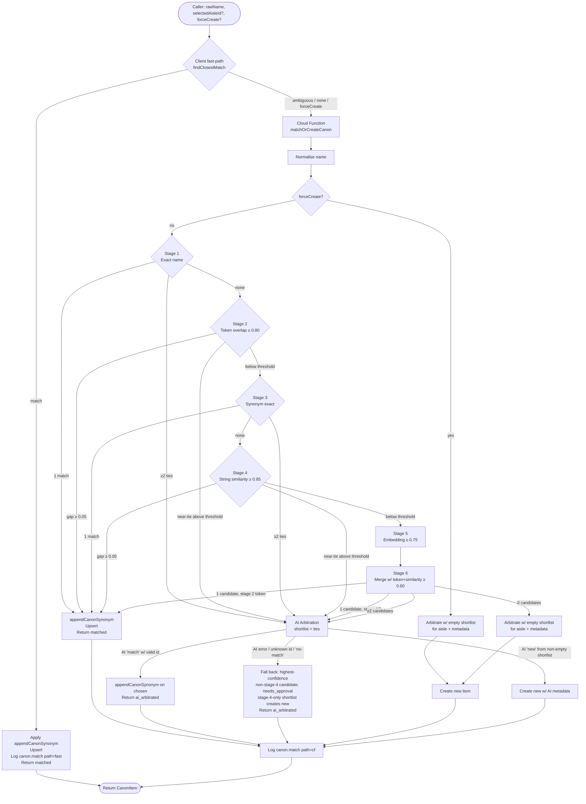

# Canon Item Matching Pipeline

Salt resolves a free-text item name to one canonical `CanonItem` through a multi-stage pipeline. Cheap deterministic checks run first; AI arbitration and embeddings run only when the deterministic stages can't decide. The pipeline is authoritative — it always returns one concrete `CanonItem` and is the only path that writes synonyms or sets `needs_approval`.

The same pipeline is the entry point for all four use cases: manual canon item add, shopping list add, recipe add, and recipe ingredient update. None of them block on a user dialog mid-flow.

---

## Authority and runtime

The pipeline is invoked from two server-side entry points:

1. **`matchOrCreateCanon` CF callable** — the client-facing entry point for explicit canon resolution (manual canon item add, recipe add, recipe ingredient update). Composes Firestore-admin stores, Genkit-backed embedding + arbitration adapters, an ID generator, and a fan-out `MatchLoggingPort` that writes each resolution to two destinations: PostHog (via `posthog-node`, parity with the fast-path's wire shape — see [Logging schema](#logging-schema)) and `firebase-functions/logger` (top-level summary only, additive for Cloud Logging).

2. **`onShoppingListItemWrite` Firestore trigger** — fires on every write to `shoppingLists/{listId}/items/{itemId}`. Idempotency: skips when `matchState !== 'pending'` or `canonId` is already set (CF own write). Before matching, runs `parseShoppingListEntry` (deterministic) to split the raw entry into a clean item name, an optional trailing context note, and optional structured `amount` (number) and `unit` (string); for compound entries (≥3 words) where neither context nor a structured amount was extracted, falls back to the `EntryParsePort` AI adapter and degrades gracefully on failure. The clean name and the original `rawText` are fed to `matchOrCreate` via `buildMatchOrCreatePorts`; `rawText` is forwarded as optional context to the arbitration AI prompt when it differs from the normalised name. On success, if the name changed and the item's `notes` field is currently empty, writes `rawText: cleanName` and `notes: context` atomically with `canonId` and `matchState`. Writes `canonId`, `matchState` (`matched` | `needs_approval` | `failed`), and — when parsed — `amount` and `unit` back to the item document on both success and failure paths. This is the matching entry point for shopping list adds.

The client also runs a **fast-path** for stages 1–4 against the in-memory canon snapshot. If `findClosestMatch` returns a clear `'match'`, the client applies `appendCanonSynonym`, persists, and returns without a CF round-trip. `'ambiguous'` and `'none'` always escalate to the CF callable; `forceCreate` always escalates so the CF can run aisle arbitration. Stages 1–4 are executed by the same `findClosestMatch` function in both places, so the deterministic outcome is identical for the same canon snapshot. Both paths attach a `canon.path: 'fast' | 'cf'` attribute to their span so dashboards can split traffic.

`findClosestMatch` is the only stage 1–4 entry point — `tokenMatch`, `stringSimilarity`, `synonymMatch`, and `embedMatch` are not exported and the boundary lint forbids reaching past `findClosestMatch` to call them.

---

## Flow diagram

---

## Stage-by-stage narrative

> **Stages 1–4 are dual-run.** They live in [`findClosestMatch`](../packages/domain/src/canon/queries/findClosestMatch.ts) and execute on both the client fast-path (against the in-memory canon snapshot) and the CF (against the Firestore-loaded canon). Same code, same stage logs, same `'match' | 'ambiguous' | 'none'` outcome for the same input + canon. Stages 5–6 and AI arbitration are CF-only.

### Stage 1 — Exact name match

Both query and every canon item name run through `normaliseName` (lowercase, trim, collapse whitespace). One winner → `match`. Two or more winners → `ambiguous` (sent to AI arbitration to disambiguate true duplicates). No winners → fall through to stage 2.

### Stage 2 — Token overlap

Jaccard-style overlap between word tokens of the query and item name. Threshold **0.80**. If best ≥ threshold and (best − second) ≥ ambiguity gap (**0.05**), `match`. If best ≥ threshold but the gap is too small, all near-ties become an `ambiguous` shortlist.

### Stage 3 — Synonym exact match

Each `CanonItem` carries normalised synonyms accumulated from past confirmed matches. Stage 3 checks for an exact synonym hit. Single hit → `match`. Multiple hits → `ambiguous`. No hits → fall through to stage 4.

### Stage 4 — String similarity (Levenshtein)

Normalised Levenshtein distance. Threshold **0.85**. Same ambiguity-gap rule as stage 2.

### Stage 5 — Embedding cosine

Gemini embedding of the query, cosine similarity against every canon item with a stored embedding. Threshold **0.75**. Embedding *never* auto-matches on its own — it only feeds the shortlist. Tie-break favours already-approved items so the review queue isn't padded.

### Stage 6 — Merged shortlist + AI arbitration

Stage 6 re-runs token overlap and string similarity at the lower **0.60** `aiThreshold` and merges them with stage-5 candidates into a single deduplicated shortlist ordered by confidence.

- 0 candidates → arbitrate with an empty shortlist (purely for aisle/metadata) and create.
- 1 candidate, **from token overlap (stage 2)** → `match` directly without calling arbitration.
- 1 candidate, **from string similarity (stage 4) or embedding (stage 5)** → AI arbitration (treated like a multi-candidate shortlist; see [Stage 4 is AI-confirm-only](#stage-4-edit-distance-is-ai-confirm-only)).
- ≥2 candidates → AI arbitration on the shortlist.

A lone candidate bypasses AI only when it comes from token overlap — structural word-sharing ("olive oil" → "olive oil extra"). Edit-distance and embedding similarity are coincidence-prone signals that must be AI-confirmed before they bind.

---

## AI Arbitration

AI arbitration is the sole decider after stages 1–4 produce an `'ambiguous'` shortlist or stage 6 produces a multi-candidate shortlist. There is **no `'candidates'` decision and no mid-flow user dialog** — review happens later, asynchronously, via the `needs_approval` flag.

When `rawText` (the original user entry) differs from the normalised item name, it is passed to the arbitration prompt as a context hint — container or descriptor words such as "tin of", "smoked", or "fresh" can help the model distinguish near-duplicate canon items. The model always matches against the normalised name; `rawText` is informational only.

### AI-fallback rule (behavioural contract)

The pipeline falls back to the **highest-confidence shortlist candidate that is not a pure edit-distance (stage-4) match**, flagged `needs_approval` (set by `appendCanonSynonym`), on any of these three triggers:

1. **AI adapter error.**
2. **AI returns `kind: 'match'` with an `itemId` not present in the shortlist** (unknown id).
3. **AI returns `kind: 'no-match'` from a non-empty shortlist.**

`AI 'new'` is the **only** path that creates a brand-new item from a non-empty shortlist — except that a shortlist whose only members are stage-4 candidates also creates a new item (the fallback skips them; see below).

#### Stage 4 (edit distance) is AI-confirm-only

Edit-distance (stage-4) candidates in the `[0.60, 0.85)` band are spelling coincidences, not confident matches — `"olives"` and `"limes"` normalise to `"olive"`/`"lime"` and score exactly **0.60** Levenshtein. Such a candidate binds **only** when the AI returns a positive `kind: 'match'` for it. It never binds via the lone-candidate shortcut (Stage 6, above) nor via this degraded fallback. A stage-4-only shortlist therefore resolves to a **new item** on AI error / unknown-id / `no-match`, rather than silently merging unrelated foods. Token overlap (stage 2) and embedding (stage 5) candidates remain valid fallback targets. Genuine typos are unaffected: they either clear stage 4's 0.85 stop or normalise to an exact stage-1 hit inside `findClosestMatch`, never reaching this band.

The empty-shortlist case is different: with no candidates to fall back to, AI error or `'no-match'` results in a fresh create (with whatever aisle/metadata arbitration managed to return, or none). All four entry points (canon add, shopping list add, recipe add, recipe ingredient update) inherit this same rule via the shared CF.

**Failsafe before `persistNew` (empty-shortlist and `forceCreate` paths):** After arbitration returns a `canonName` for the new item, `applyClassification` runs `findSnapshotMatch(canonName, snapshot)` before calling `persistNew`. If the name already exists in the snapshot (e.g., the AI correctly returns "Garlic" for a raw input of "1 head of garlic" that scored below threshold on stages 1–4), the pipeline resolves to the existing item as `ai_arbitrated` rather than creating a duplicate. This guard is needed because callers such as `authorRecipe` may pass raw ingredient text — quantity/unit tokens collapse stage 1–4 scores below threshold, landing on the empty-shortlist path, yet the AI often identifies the right canonical name.

| AI response (non-empty shortlist) | Pipeline action | Decision returned |
|---|---|---|
| `match` with valid `itemId` | `appendCanonSynonym` on chosen item; AI `reasoning` stored on item if present | `ai_arbitrated` |
| `match` with unknown `itemId` | Fall back to top-confidence **non-stage-4** candidate, flag `needs_approval`; stage-4-only shortlist creates new | `ai_arbitrated` / `created` |
| `new` (with metadata) | Create new item with AI-suggested aisle, behaviour, unit; `reasoning` stored if present | `created` |
| `no-match` | Fall back to top-confidence **non-stage-4** candidate, flag `needs_approval`; stage-4-only shortlist creates new | `ai_arbitrated` / `created` |
| Error | Fall back to top-confidence **non-stage-4** candidate, flag `needs_approval`; stage-4-only shortlist creates new | `ai_arbitrated` / `created` |

### Why fall back rather than create new

A non-empty shortlist means at least one item scored above `aiThreshold` (0.60) on token overlap, similarity, or embedding cosine. Treating an AI failure mode as licence to create a duplicate would silently pad the canon with near-twins. Surfacing the resolution as `needs_approval` instead lets the human review queue catch it, while still returning a usable `CanonItem` to the caller — shopping list adds (the most latency-sensitive entry point) stay non-blocking.

---

## Review via `needs_approval`

`needs_approval` is the universal "human should look at this" signal. `appendCanonSynonym` sets it whenever a synonym is added; the AI-fallback path inherits it that way. When AI arbitration returns a `'match'` or `'new'` response that includes a `reasoning` string, `appendCanonSynonym` (or the item-creation path) also stores that string as `CanonItem.reasoning` — it surfaces in the canon review UI alongside `needs_approval` items for auditing why the AI made a given decision. When arbitration is invoked during new-item creation (empty-shortlist or `forceCreate` paths) but fails to produce a canonical name, a sentinel string is written instead: `ARBITRATION_FAILED_REASONING` when the adapter returned an error, or `ARBITRATION_NO_MATCH_REASONING` when the AI ran but returned no match. This lets the review queue distinguish the two failure modes while still creating the item with raw input and flagging `needs_approval`. The canon list page is the review queue: items with `needs_approval` are highlighted, promoted to the top, and support multi-select bulk-approve. The canon nav menu item carries a count badge of `needs_approval === true` items so the queue is visible from anywhere in the app.

The canon item detail page also exposes a **split** action: take the most-recently-added synonym off the current item and promote it into a new canon item (flagged `needs_approval`). This is the corrective path when the pipeline added a synonym to the wrong canonical item.

---

## Logging schema

The pipeline emits one log record per resolution. The fast-path (client) writes via the PostHog `MatchLoggingPort` ([`createPosthogMatchLoggingAdapter`](../packages/adapters/observability/src/posthogMatchLoggingAdapter.ts)). The CF writes via two adapters composed: `posthog-node` ([`createPosthogServerMatchLoggingAdapter`](../packages/adapters/observability/src/server/posthogServerMatchLoggingAdapter.ts)) and `firebase-functions/logger` ([`createServerMatchLoggingAdapter`](../apps/cloud-functions/src/adapters/serverMatchLog.ts)). All emissions carry a `path: 'fast' | 'cf'` discriminator.

The schema below describes the **domain `MatchLogEntry`** — the in-memory log object built by `MatchLogBuilder` and passed to `MatchLoggingPort.write`. Adapters serialise this object to their destination's conventions (see [Adapter serialisation](#adapter-serialisation) for what actually goes on the wire).

> **Parity contract enforced.** The fast-path and CF PostHog emissions both flow through a single shared mapper ([`toCanonMatchEvent`](../packages/adapters/observability/src/shared/matchOutcomeEvent.ts)), so the `canon.match` event name and its property names/scaling are structurally identical for the same `MatchLogEntry` — drift is not possible without a deliberate edit to the shared file. The `firebase-functions/logger` emission on the CF side is additive (top-level summary only) and exists for Cloud Logging dashboards; it does not need to match the PostHog event schema. The structural drift guard is enforced by [`tests/matchLogParity.test.ts`](../packages/adapters/observability/tests/matchLogParity.test.ts).

### Top-level fields

| Field | Type | Source |
|---|---|---|
| `canon.path` | `'fast' \| 'cf'` | Adapter — fast-path or CF |
| `correlationId` | string | One per resolution |
| `rawInput` | string | Caller's `rawName` |
| `normalizedInput` | string | `normaliseName(rawName)` |
| `inputItemCount` | number | Size of canon snapshot considered |
| `totalDurationMs` | number | Wall-clock for the resolution |
| `decision` | `'matched' \| 'created' \| 'ai_arbitrated'` | Final outcome |
| `finalItemId` / `finalItemName` | string \| null | Resolved `CanonItem` |

### Per-stage fields (stages 1–4 — fast-path + CF parity)

Each stage record is one entry in the `stages[]` array. Fields and types are identical across fast-path and CF emissions.

| Field | Type | Notes |
|---|---|---|
| `stage` | number (1–4) | Stage ordinal |
| `stageName` | `'exact_name' \| 'token_overlap' \| 'synonym' \| 'string_similarity'` | Stable identifier |
| `threshold` | number | Stop threshold for the stage |
| `passed` | boolean | Whether the stage produced ≥1 candidate above threshold |
| `consideredCount` | number | Items scored at this stage (= canon snapshot size for 1–4) |
| `durationMs` | number | Stage wall-clock |
| `topCandidates[]` | `{ itemId, itemName, score }[]` | Top 5 candidates by score (stages 2 & 4 always; stages 1 & 3 only when `passed`) |
| `bestScore` | number \| null | Highest score this stage observed (1.0 for stages 1 & 3 hits) |
| `gap` | number \| null | Stage 1: 1.0 single / 0.0 tie / null miss. Stage 2/4: (best − second) when `passed`, else (best − threshold). Stage 3: same convention as stage 1. |
| `skipReason` | `null` for stages 1–4 | Reserved for stages 5–6 |

#### Per-stage outcomes

- **Stage 1** (`exact_name`) — 1 winner ⇒ `'match'`; ≥2 winners ⇒ `'ambiguous'`; otherwise fall through.
- **Stage 2** (`token_overlap`, threshold 0.80) — best ≥ threshold and gap ≥ ambiguityGap ⇒ `'match'`; best ≥ threshold and gap < ambiguityGap ⇒ `'ambiguous'`; otherwise fall through.
- **Stage 3** (`synonym`) — 1 hit ⇒ `'match'`; ≥2 hits ⇒ `'ambiguous'`; otherwise fall through.
- **Stage 4** (`string_similarity`, threshold 0.85) — same shape as stage 2.

`findClosestMatch` returns `'match' | 'ambiguous' | 'none'` — `'none'` is reached only when stages 1–4 all fall through (or the normalised input is empty). The resolved `CanonItem` and final `decision` are set by `matchOrCreate` (CF) or by the fast-path branch in `addCanonItem` (client).

### Per-stage fields (stages 5–6 — CF only)

These stages run only on the CF (the client fast-path never embeds or arbitrates). The same `StageLog` shape is reused, with `skipReason` populated when the stage cannot run.

**Stage 5 — `embedding`** (threshold 0.75)

| Field | Notes |
|---|---|
| `topCandidates[].score` | Cosine similarity |
| `topCandidates[].reason` | `cosine:<score>` for traceability |
| `bestScore` | Best cosine observed; null if skipped |
| `gap` | best − stage5Stop (negative when not passing) |
| `skipReason` | `'no_items'` (no canon items have an embedding) or `'embedding_error'` (port returned err); `null` when the stage ran |

**Stage 6 — merged shortlist** (`aiThreshold` 0.60)

Stage 6 is implicit in `matchOrCreate`'s `buildShortlist`: it merges stage 5's passing embeddings with token overlap ≥ 0.60 and string similarity ≥ 0.60, deduplicates by item id (highest-confidence wins), and orders by confidence. There is no separate `StageLog` entry for stage 6 today; arbitration over the resulting shortlist is captured in the top-level `arbitration` field instead:

| `arbitration` field | Notes |
|---|---|
| `reason` | `'ambiguous_near_tie' \| 'near_miss_shortlist' \| 'aisle_suggestion'` |
| `candidatesIn` | Shortlist size at arbitration time |
| `aislesIn` | Aisle list size sent to the AI |
| `prompt` / `rawResponse` | Truncated to 2000 chars where the property cap applies |
| `outcome` | `'match' \| 'new' \| 'no-match' \| 'error'` |
| `durationMs` | AI call wall-clock |

### Adapter serialisation

Three adapters write the `MatchLogEntry`. The two PostHog adapters share a runtime-neutral mapper, so their wire shapes are identical for the same entry:

- **Browser PostHog adapter** ([`posthogMatchLoggingAdapter.ts`](../packages/adapters/observability/src/posthogMatchLoggingAdapter.ts)) — fast-path. Emits the slim `canon.match` PostHog event for the entry via `posthog.capture`, tagged `canon_path: 'fast'`.
- **Server PostHog adapter** ([`posthogServerMatchLoggingAdapter.ts`](../packages/adapters/observability/src/server/posthogServerMatchLoggingAdapter.ts)) — CF. Emits the same `canon.match` event via `posthog-node`, tagged `canon_path: 'cf'`, using the same shared mapper. The flow flushes pending telemetry before returning so events aren't lost when the Node process is paused.
- **Shared mapper** ([`matchOutcomeEvent.ts`](../packages/adapters/observability/src/shared/matchOutcomeEvent.ts)) — single source of truth for the `canon.match` wire schema (`toCanonMatchEvent`). It projects the full `MatchLogEntry` down to a slim, analytics-grade event: `canon_input`, `canon_normalized` (only when it differs), `canon_decision`, `canon_result_id`, `canon_result`, the winning-stage fields `canon_winning_stage` / `canon_winning_stage_name` / `canon_confidence` (all omitted when nothing matched), and the context fields `canon_path`, `canon_correlation_id`, `canon_input_count`, `canon_total_duration_ms`. The winning confidence is scaled `×100` and rounded to 2dp (so `bestScore: 0.8421` becomes `canon_confidence: 84.21`). The verbose per-stage candidate dumps and the arbitration prompt/response are deliberately **not** carried on the analytics event.
- **Server `firebase-functions/logger` adapter** ([`serverMatchLog.ts`](../apps/cloud-functions/src/adapters/serverMatchLog.ts)) — CF only, additive. Emits `logger.info('canon.match', { … })` with `path: 'cf'`, `summary` (one-line trace), `correlationId`, `decision`, `rawInput`, `normalizedInput`, `finalItemId`, `finalItemName`, `inputItemCount`, `totalDurationMs`. Cloud Logging captures these alongside other CF logs for ops debugging; there is no per-stage detail here by design.

### Trace context unification (env-gated)

Each CF invocation renders as one coherent trace via two context sources in fixed precedence:

1. **Browser-supplied `traceparent` field** on the callable wire input — extracted via `runWithSuppliedTraceContext`. **Preferred when present.** The Firebase JS callable SDK cannot carry custom per-call HTTP headers (`HttpsCallableOptions` only exposes `{ timeout?, limitedUseAppCheckTokens? }`), so the browser supplies a W3C `traceparent` string as a NAMED, TYPED, OPTIONAL field on the wire payload — the **only** channel that can carry the browser's trace id and unify the browser action with the server flow. Wire-envelope schemas in `@salt/domain/schemas` extend the domain input with `{ traceparent: z.string().optional() }` and it is **stripped at the CF entrypoint** so the domain flow receives pure domain input. `firebase-sync` callable wrappers forward the string and never import `@salt/observability` (Rule 4). A missing or malformed `traceparent` never fails the call (Rule 10).
2. **Inbound W3C trace _header_** off `request.rawRequest.headers` (what the platform/GCP injects) — extracted via `runWithExtractedTraceContext`. **Fallback only** when no non-empty field is present. The header is GCP's fresh request-trace root; preferring it would re-root away from the browser trace and could never unify with it.

The Genkit flow span nests under the caller's trace context instead of re-rooting a fresh trace. The single process-wide tracer provider is owned by `enableFirebaseTelemetry()`; both helpers degrade to a plain call when no usable context is present and never throw.

**Firestore trigger continuity:** Firestore triggers carry no inbound HTTP headers, so an OPTIONAL `traceContext` field (a W3C `traceparent` string) on the written doc bridges the trace forward. `ShoppingListItemSchema` and `CanonItemSchema` each carry `traceContext: z.string().optional()`. `onShoppingListItemWrite` reads `traceContext` off the item doc and runs canon-matching within `runWithSuppliedTraceContext`; it also threads `traceContext` into the canon write-back so `onCanonItemWritten` can continue the same trace for icon and embedding work. Both triggers first await a CF-local telemetry-readiness gate (`whenCfTelemetryReady()`, armed by `index.ts` with the `enableFirebaseTelemetry()` boot promise) before extracting the supplied context — a cold-start trigger fires before the OTel propagator + async-hooks context manager are live, and without the gate `propagation.extract` hits the no-op propagator and silently drops the supplied trace. The gate is bounded (10 s) and degrades to a normal root trace on timeout (Rule 10); it resolves immediately in unit tests and on warm instances. Result: "Add 'tinned tomatoes' to shopping list" is ONE trace — browser action → canon-match trigger → icon trigger. `traceContext` is transport-only; domain logic never branches on it.

**Env gate:** the entire mechanism is SUPPRESSED when `GENKIT_TELEMETRY_SERVER` is set (local `pnpm dev:emulators`) so flows stay **root-listed** in the Genkit Dev UI. This env-gate resolved the 2026-05-11 regression (a non-root flow span was filtered from the Genkit Dev UI trace list). `setActiveSpanName` is called inside the flow body to append the item name so the span is scannable in the Genkit / Cloud trace view.

---

## Batch entry point — recipe ingredient canonicalisation

A recipe canonicalises many ingredient names at once (a 35-ingredient recipe). The naive shape — one `matchOrCreateCanon` call per ingredient — re-reads the entire `canonItems` collection (each doc's 3072-float embedding) once per ingredient, and lets two ingredients race to create the same new item because no call sees what another just created. The `canonicaliseRecipeIngredients` callable resolves the whole list in **one** invocation: it reads the canon snapshot once, embeds names in batched calls, and accumulates in-batch creations so duplicates collapse.

**There is one matching path. A single item is a batch of one.** Both stages and orchestration are shared, so stages, thresholds, arbitration, `needs_approval`, and per-item match-log emission cannot drift between single and batch.

### One path: batch, with single as `n = 1`

`matchOrCreate`'s body is a **three-phase batch orchestrator** that fans each phase across the whole input list, and the single-item entry point becomes a thin alias:

- **`matchOrCreateBatch(inputs, ports)`** — the one matching function. Loads snapshot + aisles **once**, batch-embeds all names into a cache (below), then runs three phases:
  1. **Classify** — `classifyOne(input, snapshot, aisles, ports)` runs stages 1–5 plus shortlist construction for **every** input in parallel. **No AI calls and no persist.** Each input is classified as a direct match, a no-AI create, or "needs arbitration".
  2. **Arbitrate** — every classification tagged `needs_ai` fires its `arbitrate` call in parallel. For a 35-ingredient recipe this collapses ~35 × 3 s sequential into ~3 s total — the entire reason the batch path exists.
  3. **Apply** — `applyClassification(classification, arbOutcome, snapshot, ports)` applies the classification + AI result and persists via `ports.store.upsert`, **in order**, folding each resolved `CanonItem` back into the snapshot so later inputs see it.

  Returns an order-preserving array of `MatchOrCreateResult`.
- **`matchOrCreate(input, ports)`** — unchanged public signature, now a one-line alias: `(await matchOrCreateBatch([input], ports))[0]`. The hot single-item path (add-item, shopping-list trigger, single ingredient update) runs through the same three phases with a batch of one — a one-element embed call, one classify, at most one arbitrate. Negligible overhead; zero behavioural difference.

The single source of truth for matching behaviour is the `classifyOne` → arbitrate → `applyClassification` chain; there is no separate per-item resolver and no second implementation to keep in step. The parity test below confirms `batch([x])` behaves like `batch([x, y, z])` for the same `x` — true by construction — rather than reconciling two code paths.

The two **Cloud Function callables** are unaffected by this: `matchOrCreateCanon` (single-item callers) and `canonicaliseRecipeIngredients` (recipe batch) both call into the one domain `matchOrCreateBatch`. Keeping both callables is a wire/API decision; the matching logic underneath is single-sourced.

### Growing snapshot

The batch holds the canon set as an in-memory map keyed by id, seeded by the single `store.list()`. After each input resolves, the returned `CanonItem` is folded back into the map — both new creations **and** synonym-appended / `needs_approval` mutations of matched items — so later inputs see exactly what a fresh re-read would show. Two ingredients that resolve to the same new item therefore collapse to one canon item. The map is the matching view; writes still go through `store.upsert` per item.

### Batched embedding without forking stage 5

Stage 5 (`embedMatch`) is unchanged and runs identically in both paths. The batch pre-computes query embeddings for **all** input names in one `EmbeddingPort.computeEmbeddings([...])` call, stores them in a cache, and wraps the port so `computeEmbedding(name)` is served from that cache. `embedMatch` still calls `computeEmbedding(name)` exactly as on the single path — it just hits a warm cache. `EmbeddingPort` gains `computeEmbeddings`; the single-item `computeEmbedding` is untouched. (Embedding every name, including those that match at stages 1–4, is deliberate: it keeps the flow to one batched call and avoids a pre-pass whose stage-1–4 outcomes would shift as the snapshot grows. The cost #187 targets is the canon-read amplification, not the embed calls.)

In-batch newly-created items carry no embedding yet — canon-name embeddings are written asynchronously by the `onCanonItemWritten` trigger — so they participate in stages 1–4 and stage-6 token/string similarity but not stage-5 cosine. This is correct and needs no special-casing.

### Parity guarantee

Identity is structural — single-item is literally `matchOrCreateBatch([input])` — so the tests confirm the orchestration is order- and size-invariant rather than reconcile two implementations:

- Running each input of a fixed corpus as its own `batch([x])` against an accumulating store yields the same per-input `decision`, resolved item id, synonyms, and `needs_approval` as running them all as one `batch([x, y, z])`.
- Two inputs resolving to the same new item produce a single canon item (intra-batch dedup).

Arbitration stays per-unmatched-item; batching the arbitration *prompt* is out of scope.

---

## Reference integrity — edits and canon deletion

A stored match (`canonId` + `matchState: 'matched'`) is a pointer into the canon collection. Two events can invalidate it: the referencing item's text is edited (the old match no longer describes the line), or the canon item it points at is deleted (the pointer dangles). Salt handles the two differently, and deliberately so.

### Edits clear the match eagerly

When an item's `rawText` changes, the old match is provably wrong, so it is cleared at the moment of the edit — `canonId` → `null`, `matchState` → `'pending'`.

- **Shopping list:** `editItemRawText` resets the fields, and the `onShoppingListItemWrite` trigger re-matches automatically. No user action needed.
- **Recipe ingredients:** there is no per-ingredient trigger — recipe matching is on-demand batch (see [Batch entry point](#batch-entry-point--recipe-ingredient-canonicalisation)). The editor clears the match on edit, and the user re-runs matching explicitly: the per-row **Match** button in edit mode, or the view-page **Canonicalise** button (batch).

### Canon deletion is resolved at display time — never written back

When a canon item is deleted, referencing recipe ingredients and shopping-list items are **not** rewritten. There is no delete trigger and no client reconciliation pass. Instead, a `canonId` that no longer resolves in the live canon snapshot is treated as **unmatched at the point of use**. The stored `matched` flag stays on disk but is inert.

This is the existing behaviour of `groupItemsByAisle` (a list item whose `canonId` is absent from the canon map falls into the "other" bucket), generalised into one pure predicate — `hasLiveCanonMatch({ matchState, canonId }, canonIds)` — applied at **every** consumer of a live match:

- the ✓ "matched" badge (recipe view, shopping list);
- the "needs canonicalising" eligibility filter and the Canonicalise button — so a dangling ingredient is offered for re-matching exactly like a `pending`/`failed` one;
- recipe→list extraction's canon carry (`buildRecipeAddPlan`) — a dangling ingredient is added as raw text, not with a stale `canonId`;
- aisle grouping.

The predicate is pure domain (`packages/domain`); the canon-id set is built from the in-memory canon store by the `web-pwa` caller and passed in, so domain takes no I/O dependency on canon.

**Why display-time, not write-back.** Recipe ingredients live nested at `ingredients[].items[].canonId`, which Firestore cannot index or query — a delete trigger would have to full-scan the recipes collection. And rewriting a shopping-list item back to `pending` would re-fire `onShoppingListItemWrite`, re-matching it and potentially re-creating the very canon item just deleted. Display-time derivation sidesteps both, costs nothing on the delete path, and is correct regardless of which client (or an offline one) performed the deletion. The user **sees** the item go unmatched and re-triggers matching themselves — nothing silently rewrites their data.

---

## Thresholds at a glance

| Constant | Value | Used at |
|---|---|---|
| `stage1Stop` | 1.0 | Stage 1 normalised exact match (sentinel) |
| `stage2Stop` | 0.80 | Stage 2 token overlap stop |
| `stage3Stop` | 1.0 | Stage 3 synonym exact match (sentinel) |
| `stage4Stop` | 0.85 | Stage 4 string similarity stop |
| `stage5Stop` | 0.75 | Stage 5 embedding stop |
| `aiThreshold` | 0.60 | Stage 6 near-miss collection |
| `ambiguityGap` | 0.05 | Stages 2 & 4 auto-match gap |

All constants live in [`packages/domain/src/canon/queries/matchThresholds.ts`](../packages/domain/src/canon/queries/matchThresholds.ts).
