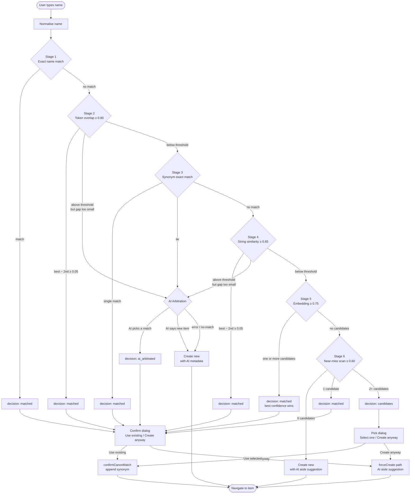

# Canon Item Matching Pipeline

When a user types a new item name, Salt runs a multi-stage pipeline to decide whether the name refers to something already in the canon or is genuinely new. Each stage is progressively slower and more expensive, so cheaper deterministic checks run first.

---

## Flow diagram

---

## Stage-by-stage narrative

### Stage 1 — Exact name match

Both the query and every canon item name are run through `normaliseName` (lowercase, trim, collapse whitespace) before comparison. A character-perfect match after normalisation is the highest-confidence signal possible.

- **Match** → `decision: matched`, pipeline stops.
- **No match** → continues to stage 2.

The code also handles `winners.length > 1` defensively (forwarding to AI arbitration), but this can only arise if the canon already contains duplicate items with the same normalised name — a data integrity problem that should not occur in normal operation.

### Stage 2 — Token overlap

The query and item names are each split into word tokens. The score is the proportion of query tokens that appear in the item name (and vice versa), producing a Jaccard-like overlap. Threshold: **0.80**.

If the best score clears 0.80 but the gap between first and second place is smaller than the ambiguity gap (**0.05**), the candidates are too close to auto-pick and are forwarded to AI arbitration instead.

### Stage 3 — Synonym exact match

Each canon item carries a list of normalised synonyms accumulated from past confirmed matches. Stage 3 checks whether the normalised query exactly matches any stored synonym. Because synonyms are only written after a human confirms a match, a hit here is as reliable as an exact name match.

- **Single match** → `decision: matched`.
- **Tie** → AI arbitration.

### Stage 4 — String similarity (Levenshtein)

Levenshtein edit-distance is used to score how close the query string is to each item name after normalisation. Threshold: **0.85** (handles common typos and minor spelling variants). The same ambiguity-gap rule as stage 2 applies.

### Stage 5 — Semantic embedding

The query is embedded using Gemini and its cosine similarity is computed against the stored embedding of every canon item that has one. Threshold: **0.75**. This catches conceptual near-equivalents that differ in wording — e.g. "spanish onions" and "onions".

All candidates above the threshold are collected. `pickBest` selects the highest-confidence one by score alone — `needs_approval` status is not a tiebreaker.

If no candidates pass the threshold, the pipeline falls through to stage 6.

### Stage 6 — Near-miss surface

Stages 2 and 4 are re-run at a lower threshold (**0.60**, the `aiThreshold`) to cast a wider net. The intent is to surface plausible alternatives rather than auto-match at lower confidence.

| Candidates found | Outcome |
|---|---|
| 0 | Item is genuinely new — create with AI aisle suggestion |
| 1 | Single unambiguous near-miss — `decision: matched` |
| 2+ | Surface all to the user — `decision: candidates` |

---

## AI Arbitration

AI arbitration runs when stages 1–4 produce a near-tie (multiple candidates above the stop threshold but with a gap below 0.05). The arbitration prompt sends the normalised query, all near-tie candidates, and the full aisle list to Gemini and asks it to pick the best match or declare the query a new item.

Possible outcomes:

| AI response | Pipeline action |
|---|---|
| `match` (with item ID) | Return `decision: ai_arbitrated` |
| `new` (with metadata) | Create new item using the AI-suggested aisle, shopping behaviour, and unit |
| Error / no-match | Create new item without AI metadata |

---

## User confirmation

Every `matched` and `ai_arbitrated` result opens a single-item confirm dialog. Every `candidates` result opens a picker. In both cases the user can either confirm an existing item or override and create a new one.

**Synonym writes happen only at confirmation.** When the user clicks "Use existing", `confirmCanonMatch` appends the normalised query to the matched item's synonym list and sets `needs_approval: true`. This ensures future searches for the same phrase resolve at stage 3 (exact synonym match) without touching the embedding API.

If the user clicks "Create anyway", the `forceCreate` path runs: all match stages are skipped, AI arbitration is called with an empty candidate list purely to suggest an aisle and populate item metadata, and a new item is created.

---

## Thresholds at a glance

| Constant | Value | Used at |
|---|---|---|
| `stage2Stop` | 0.80 | Stage 2 token overlap stop |
| `stage4Stop` | 0.85 | Stage 4 string similarity stop |
| `stage5Stop` | 0.75 | Stage 5 embedding stop |
| `aiThreshold` | 0.60 | Stage 6 near-miss collection |
| `ambiguityGap` | 0.05 | Stages 2 & 4 auto-match gap |

All constants live in [`packages/domain/src/canon/queries/matchThresholds.ts`](../packages/domain/src/canon/queries/matchThresholds.ts).
